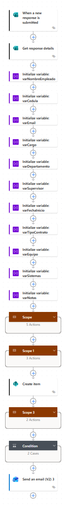
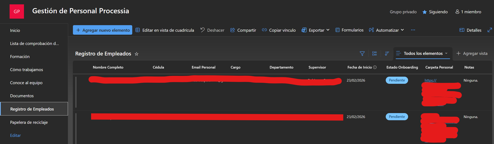
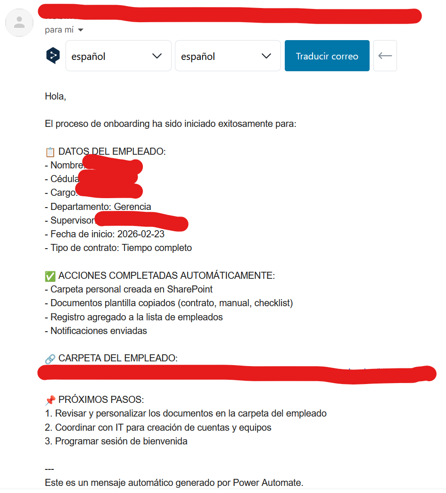

# Onboarding Automático de Empleados

**Tipo:** Cloud Flow | **Estado:** Producción  

**Plataforma:** Microsoft Power Automate | **Licencia requerida:** Free

---

## Problema resuelto

Las PYMEs gestionan el onboarding de nuevos empleados de forma 100% manual:

- Crear carpetas en servidores locales uno por uno

- Copiar documentos plantilla manualmente

- Enviar emails por separado a RRHH, supervisor e IT

- Olvidar notificar áreas clave

- Sin trazabilidad del proceso

**Resultado:** 2-3 horas invertidas por empleado nuevo, con alta tasa de errores y documentos perdidos.

---

## Solución automatizada

Un formulario de Microsoft Forms dispara automáticamente el flujo completo:

1. Captura datos del nuevo empleado vía Forms

2. Crea carpeta personal estructurada en SharePoint

3. Copia documentos plantilla (contrato, manual, checklist)

4. Registra al empleado en lista de seguimiento (SharePoint List)

5. Notifica automáticamente a RRHH, supervisor e IT

6. Envía email de bienvenida personalizado al nuevo empleado

7. Gestiona solicitudes de equipo de cómputo condicionalmente

**Resultado:** Proceso completo en menos de 2 minutos, cero errores manuales y casi nula intervención humana.

---

## Tecnologías utilizadas

| Herramienta | Uso |

| Microsoft Forms | Captura de datos del nuevo empleado |

| Power Automate (Cloud Flow) | Orquestación del proceso completo |

| SharePoint Online | Almacenamiento de documentos y lista de seguimiento |

| Office 365 Outlook | Notificaciones automáticas por email |

---

## Arquitectura del flujo

Microsoft Forms (trigger)

↓

Obtener detalles de respuesta

↓

Inicializar variables (nombre, cargo, email, etc.)

↓

📦 Scope: Crear estructura de carpetas

└── /Empleados/[Nombre]/

├── 01_Documentos_Personales/

├── 02_Contrato_y_Legal/

├── 03_Onboarding/

├── 04_Evaluaciones/

└── 05_Otros/

↓

📦 Scope: Copiar documentos plantilla

└── Contrato, Manual, Checklist → carpetas correspondientes

↓

Registrar en SharePoint List "Registro de Empleados"

↓

📦 Scope: Notificaciones

├── Email a RRHH (confirmación del proceso)

└── Email al Supervisor (bienvenida al nuevo integrante)

↓

🔀 Condición: ¿Necesita equipo de cómputo?

├── SÍ → Email a IT con solicitud detallada

└── NO → (sin acción)

↓

Email de bienvenida al nuevo empleado

---

## Resultados

| Métrica | Antes | Después |

| Tiempo por onboarding | ~120 min | ~2 min |

| Errores de documentación | ~15% | 0% |

| Notificaciones enviadas | Variable | 100% consistente |

| Trazabilidad | Ninguna | Lista SharePoint completa |

---

## Screenshots

### Vista general del flujo

### Registro en lista de empleados

### Email de aviso a supervisor 

---

## Instalación y configuración

### Prerequisitos

- Microsoft 365 (Business Basic o superior)

- SharePoint Online con permisos de edición

- Power Automate (licencia Free es suficiente)

### Paso 1 — Configurar SharePoint

Crea la siguiente estructura en tu sitio de SharePoint:

**Biblioteca de documentos:**

Documentos/

└── Empleados/

└── _PLANTILLA_NO_BORRAR/

├── 02_Contrato_y_Legal/

│ ├── PLANTILLA_Contrato_Trabajo.docx

│ └── PLANTILLA_Manual_Empleado.docx

└── 03_Onboarding/

└── PLANTILLA_Checklist_Onboarding.docx

**Lista "Registro de Empleados"** con las siguientes columnas:

| Columna | Tipo |

| Nombre Completo | Texto (Title) |

| Cédula | Texto |

| Email Personal | Texto |

| Cargo | Texto |

| Departamento | Elección |

| Supervisor | Texto |

| Fecha de Inicio | Fecha |

| Estado Onboarding | Elección (Pendiente / En Proceso / Completado) |

| Carpeta Personal | Hipervínculo |

| Notas | Texto multilínea |

### Paso 2 — Crear el formulario

Crea un formulario en Microsoft Forms con estos campos:

- Nombre completo *(requerido)*

- Número de cédula/ID *(requerido)*

- Email personal *(requerido, validación email)*

- Teléfono *(requerido)*

- Cargo/Posición *(requerido)*

- Departamento *(requerido, elección)*

- Supervisor directo *(requerido)*

- Fecha de inicio *(requerido, fecha)*

- Tipo de contrato *(requerido, elección)*

- Ubicación *(requerido, elección)*

- ¿Necesita equipo de cómputo? *(requerido, elección)*

- Accesos a sistemas necesarios *(opcional)*

- Notas adicionales *(opcional)*

### Paso 3 — Importar el flujo

1. Descarga `flows/Onboarding-Empleados-v1.0.zip`

2. Ve a [make.powerautomate.com](https://make.powerautomate.com)

3. Click en **"Mis flujos"** → **"Importar"** → **"Importar paquete (.zip)"**

4. Sube el archivo descargado

5. Configura las conexiones cuando se solicite (Forms, SharePoint, Outlook)

6. Click **"Importar"**

### Paso 4 — Actualizar placeholders

Una vez importado, edita el flujo y reemplaza:

| Placeholder | Descripción |

| `YOUR_TENANT.sharepoint.com/sites/YOUR_SITE` | URL de tu sitio SharePoint |

| `rrhh@tuempresa.com` | Email del equipo de RRHH |

| `supervisor@tuempresa.com` | Email del supervisor (o lógica dinámica) |

| `it@tuempresa.com` | Email del equipo IT |

### Paso 5 — Probar el flujo

1. Llena el formulario con datos de prueba

2. Verifica en Power Automate → Historial de ejecución

3. Confirma que se crearon carpetas en SharePoint

4. Verifica que llegaron los emails correspondientes

---

## Mejoras futuras

- [ ] Integración con Odoo para crear usuario automáticamente vía n8n

- [ ] Recordatorios automáticos de checklist pendiente (día 3, 7, 30)

- [ ] Dashboard en Power BI conectado a la lista de empleados

- [ ] Aprobación previa de RRHH antes de iniciar el proceso

- [ ] Directorio de supervisores en SharePoint para asignación dinámica de emails

---

## Autor

Mgs. Robinson Barrazueta - Ingeniería de Datos y Automatización

**Processia Ops** - Automatización de procesos empresariales

Ecuador 🇪🇨 · [processia.online](https://processia.online)

